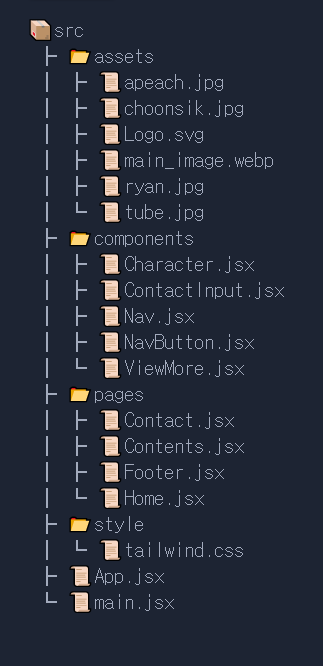

# React 2주차 과제

카카오프렌즈 캐릭터를 소개하는 페이지 시안을 React 컴포넌트를 조립하여 구현하였습니다.


### 파일 구조



## 주요 코드

### App.jsx

```js
import Contact from "./pages/Contact";
import Home from "./pages/Home";
import { BrowserRouter, Route, Routes } from "react-router-dom";

function App() {
  return (
    <BrowserRouter>
      <Routes>
        <Route path="/" exact element={<Home />} />
        <Route path="/home" element={<Home />} />
        <Route path="/contact" element={<Contact />} />
      </Routes>
    </BrowserRouter>
  );
}

export default App;
```

### Contents.jsx

```js
import Character from "../components/Character";
import choonsik from "./../assets/choonsik.jpg";
import ryan from "../assets/Ryan.jpg";
import apeach from "./../assets/apeach.jpg";
import tube from "./../assets/tube.jpg";

function Contents() {
  return (
    <div className="flex flex-col gap-2 py-2 w-[1000px] mx-auto">
      <Character
        character={choonsik}
        position="left"
        text="어느 날 라이언이 길에서 데려온 '길고양이' 춘식이"
        title="CHOONSIK"
      />
      <Character
        character={ryan}
        position="right"
        text="갈기가 없는 것이 콤플렉스인 수사자 라이언"
        title="RYAN"
      />
      <Character
        character={apeach}
        position="left"
        text="복숭아 나무에서 탈출한 악동 복숭아"
        title="APEACH"
      />
      <Character
        character={tube}
        position="right"
        text="겁 많고 마음 약한 오리 튜브"
        title="TUBE"
      />
    </div>
  );
}

export default Contents;
```

### Character.jsx

```js
import ViewMore from "./ViewMore";

function Character({ character, position, text, title }) {
  let className = "";
  if (position === "left") {
    className = "justify-start";
  } else {
    className = "justify-end";
  }

  return (
    <div
      className={` bg-yellow-400 h-[360px] overflow-hidden flex ${className} border-[1px] border-neutral-400 rounded-md`}
    >
      
      <div
        className={` mx-auto my-auto flex flex-col items-center ${
          position === "left" ? "order-last" : "order-first"
        }`}
      >
        <h2 className="text-[36px] text-[#5E471A] font-bold">{title}</h2>
        <p className="mb-2">{text}</p>
        <ViewMore />
      </div>
    </div>
  );
}

export default Character;
```
